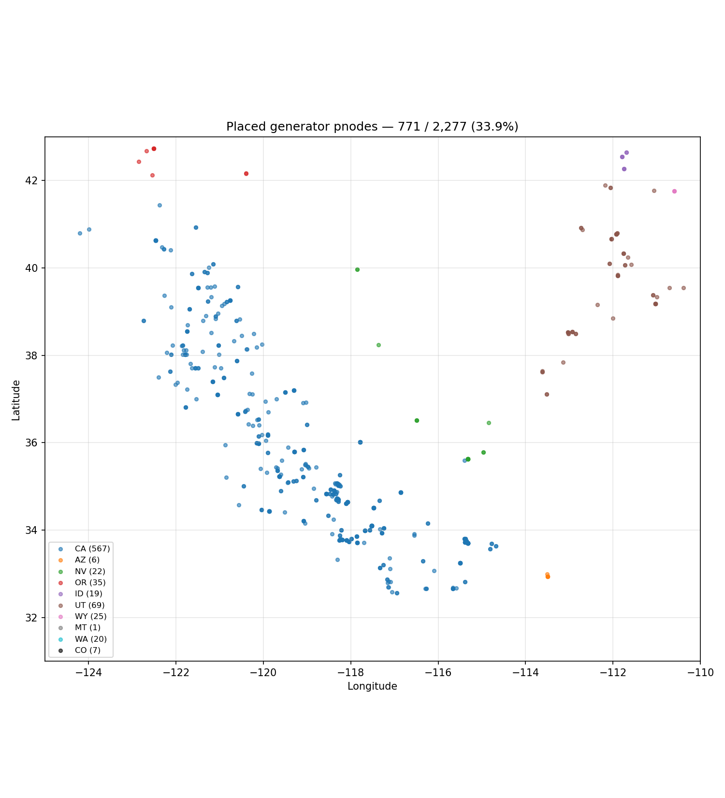

# CAISO Congestion-Relief Node Map

An interactive geographic + tabular map of CAISO pricing nodes designed to
identify **where battery storage could relieve transmission congestion**.
Each node is encoded by four channels (hue, color saturation, marker size,
fill style) derived from the **marginal congestion component (MCC) of
locational price** — not the total LMP. This is a research-grade *screening
tool*; it ranks candidate locations from public data, it does **not** confirm
deliverable relief (that requires a network-model run with PTDFs, out of
scope here).

**🌐 Live interactive map:** *(GitHub Pages URL — populate after enabling
Pages in repo settings)*



---

## What's in the map

| Channel | Encodes |
|---|---|
| **Hue** | Archetype — WHITE (no local congestion), BLUE (import pocket), RED (export pocket), PURPLE (bidirectional) |
| **Color saturation** | Round-trip MCC spread — per-archetype quintile bucket |
| **Marker size** | Controlling-constraint rent (`rating × Σ\|μ\|`), `sqrt`-scaled |
| **Marker style** | Filled (persistent value) vs hollow ring (spike-driven) |

Plus a duration selector (2 h / 4 h / 8 h battery) and a stacked composite
bar chart that shows duration sensitivity per node. Open the slide-in
**📘 How to read this** panel inside the map for the full explanation and
formula reference.

---

## Pipeline (run order)

The numbered scripts implement Phases A → F of the build runbook (`caiso_map_build_runbook (1).md`). Each is self-contained and prints
`BLOCKER:` lines if any data-quality gate fails.

| Script | What it does |
|---|---|
| `a1_probe_pull.py` | One-day RTM 5-min LMP pull for a flat probe node; verifies CAISO exposes MCC as a separate component |
| `a2_decomposition_check.py` | Asserts `LMP - Σ(components) < $0.05` |
| `a3_constraints_pull.py` | Pulls intertie + nomogram shadow prices |
| `a4_scope_inventory.py` | Counts distinct pricing nodes; samples season coverage |
| `b1_probe_month.py` | One-month RTM pull for two probe nodes; hourly resample |
| `b2_archetype.py` | Archetype classifier on the probes |
| `b3_spread.py` | Round-trip MCC spread on the probes |
| `b4_concentration.py` | Bankability concentration on the probes |
| `c1_scale_metrics.py` | **~2-hr bulk pull** of August 2025 MCC for ~2,300 generator pnodes (12 batches × 31 days, fully resumable); writes per-node archetype/spread/conc |
| `d1_shadow_panel.py` | Builds the constraint × time shadow-price panel |
| `d2_attribution.py` | OLS / Ridge / Lasso regression of probe MCC on the panel; controlling-line identification |
| `d3_rating_crosswalk.py` | Parses the WECC Path Rating Catalog PDF; builds constraint → MW rating crosswalk |
| `d4_attribute_size.py` | Multi-output Ridge across all nodes; per-node controlling constraint k* + size = rating × Σ\|μ\| |
| `e1_place_gen_nodes.py` | EIA-860 fuzzy match → lat/long; hand-curated alias map for well-known LA Basin plants |
| `e2_coverage_report.py` | Placement status (precise / unplaced) + coverage report |
| `f1_render_map.py` | Builds the interactive HTML (Plotly + custom shell). Writes `index.html` + a named copy. |
| `f2_audit_outputs.py` | Canonical `node_metrics.csv` per brief §8 |
| `g2_duration_sweep.py` | Recomputes spread for D=2/4/8 h, used by the map's duration selector |

Audit helpers:
- `audit_placements.py` — flag suspicious plant matches (multiple distinct abbreviations resolving to the same EIA plant)
- `audit_mixed_stacks.py` — coord-stacks where co-located nodes carry different archetypes (mostly legitimate; see README "Why some dots stack with different colors")

---

## How to regenerate everything from scratch

Estimated wall time end-to-end: **~2.5 hours** (dominated by the C1 bulk pull).

```bash
# 0. install
pip install gridstatus pandas numpy plotly matplotlib geopandas \
            scikit-learn pypdf requests

# 1. Phase A (data sanity checks) — seconds
python3 a1_probe_pull.py
python3 a2_decomposition_check.py
python3 a3_constraints_pull.py
python3 a4_scope_inventory.py

# 2. Phase B (probe vertical slice) — ~5 min total (one bulk pull)
python3 b1_probe_month.py
python3 b2_archetype.py
python3 b3_spread.py
python3 b4_concentration.py

# 3. Phase C (scale across all generator pnodes) — ~2 hours
#    Resumable: re-running picks up after the last completed batch.
python3 c1_scale_metrics.py

# 4. Phase D (shadow-price panel + attribution + sizing) — ~5 min
python3 d1_shadow_panel.py
python3 d2_attribution.py
# WECC catalog PDF (one-time download):
mkdir -p data/wecc && curl -fSL \
  -o "data/wecc/2026_path_rating_catalog_public.pdf" \
  "https://www.wecc.org/sites/default/files/documents/progress_report/2026/2026%20Path%20Rating%20Catalog%20Public_V3.pdf"
python3 d3_rating_crosswalk.py
python3 d4_attribute_size.py

# 5. Phase E (geolocation) — ~1 min
# EIA-860 ZIP (one-time download):
mkdir -p data/eia && curl -fSL \
  -o "data/eia/eia8602025ER.zip" \
  "https://www.eia.gov/electricity/data/eia860/xls/eia8602025ER.zip"
unzip -o data/eia/eia8602025ER.zip \
  "2___Plant_Y2025_Early_Release.xlsx" \
  "3_1_Generator_Y2025_Early_Release.xlsx" -d data/eia/
python3 e1_place_gen_nodes.py
python3 e2_coverage_report.py

# 6. Phase F + G2 (render + duration sweep) — seconds
python3 g2_duration_sweep.py
python3 f1_render_map.py
python3 f2_audit_outputs.py
```

The deliverable HTML is `index.html` (also saved as `caiso_congestion_map_summer2025.html`). Open it directly in any browser — it's self-contained (loads Plotly from CDN).

---

## Outputs (committed; small)

- `index.html` — the interactive map + ranked bar chart + slide-in explainer
- `data/node_metrics.csv` — per-node table (brief §8 canonical columns)
- `data/coverage_report_summer2025.txt` — parameters used, coverage breakdown
- `data/constraint_rating_crosswalk_summer2025.csv` — controlling-line → MW rating, human-audited top 30
- `data/duration_sweep_summer2025.csv` — per-node spread at D=2 / 4 / 8
- `data/spike_spread_nodes_summer2025.csv` — top 1% spread outliers
- `data/spread_histogram_summer2025.png`, `data/size_histogram_summer2025.png`, `data/placed_gen_nodes_summer2025.png`

## Outputs (gitignored; regenerate via scripts)

- `data/mcc_raw/`, `data/mcc_days/` — per-batch cache from C1 (~40 MB)
- `data/mcc_wide_summer2025.parquet` — full month MCC tensor (76 MB)
- `data/itc_raw_*.parquet`, `data/nom_raw_*.parquet`, `data/shadow_panel_wide_*.parquet` — shadow-price panels
- `data/rtm_5min_*.parquet`, `data/rtm_hourly_*.parquet` — probe caches
- `data/eia/`, `data/wecc/` — downloaded source data

---

## Background documents

- `caiso_congestion_map_build_brief.md` — design rationale & encoding spec
- `caiso_map_build_runbook (1).md` — execution order with trust gates

## Data sources

- [CAISO OASIS](http://oasis.caiso.com) (via [`gridstatus`](https://github.com/kmax12/gridstatus)): 5-min RTM LMP with congestion component, plus nomogram + intertie shadow prices
- [WECC 2026 Path Rating Catalog (Public)](https://www.wecc.org/wecc-document/26556): named transmission-path MW ratings
- [EIA-860](https://www.eia.gov/electricity/data/eia860/) 2025 Early Release: generating-plant coordinates
